# tls-tunnel
A TCP forwarder with Transport Layer Security.

## config
```toml
[global]
# specific ca info here, we will check revoke with GET CA_URL/revoke/check?digest=CERT_FINGERPRINT
ca_url = "http://127.0.0.1:8000"
ca_pubkey = "./ca_pub.pem"

[tunnels]
[tunnels.any_tcp_server]
# 0: server mode
# 1: client mode
# 2: server mode with client auth
# 3: client mode with client auth
mode = 0
# cert and privkey will be used to prove you are the real server
# must be signed by CA and not in revoke list
cert = "./TLS_ca.crt"
privkey = "./TLS_ca.pem"
privkey_password = "YOUR_PRIVATE_KEY_PASSWORD"
# local tcp addr, we will forward decrypted traffic to here
dest = ["127.0.0.1", 8000]
# listen addr
listen = ["0.0.0.0", 18000]
# you can enable proxy protocol, pass real ip to backend
proxy_protocol = false

[tunnels.any_tcp_client]
mode = 1
# here means the common_name of server cert
uid = "TLS_ca"
dest = ["127.0.0.1", 18000]
# traffic from here will be encrypted and send to server
listen = ["127.0.0.1", 28000]
```

## usage
```sh
python main.py -c YOUR_CONFIG_FILE
```

## technical details
